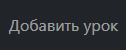
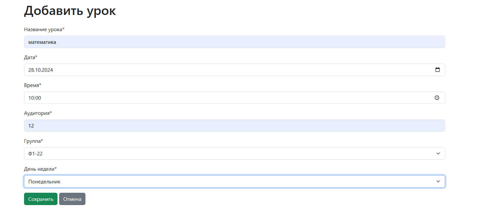
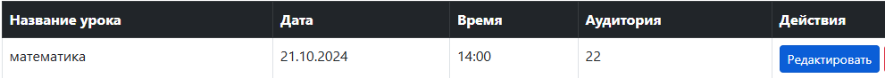
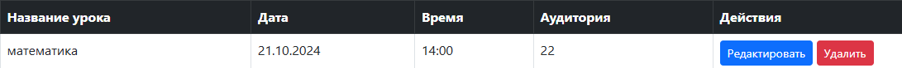
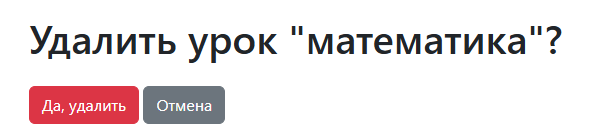

my_schedule (Управление расписанием занятий на Django)

[!IMPORTANT]
Данный проект находится в разработке.

# **Обзор проекта**

Приложение my_schedule — это веб-приложение на Django, предназначенное для управления расписанием занятий. Оно предоставляет пользователям следующие возможности:

*-Просмотр расписания занятий по дням недели и выбранной группе.*

*-Добавление, редактирование и удаление уроков.*

*-Управление учебными группами.*

# **Использование административного интерфейса Django для управления данными.**

**Установка и запуск**

Требования

Python 3.x

Django 3.x или выше

Установленные зависимости из requirements.txt
Инструкции по установке
Клонируйте репозиторий с помощью Git:

git clone https://github.com/ваш_логин/my_schedule.git
Перейдите в каталог проекта:

cd my_schedule
Создайте и активируйте виртуальное окружение:

python -m venv venv
# Для Windows
venv\Scripts\activate
# Для Unix/MacOS
source venv/bin/activate
Установите зависимости:

pip install -r requirements.txt

Выполните миграции базы данных:

python manage.py migrate

**Создайте суперпользователя для доступа к административному интерфейсу:**

python manage.py createsuperuser

Запустите сервер разработки:

python manage.py runserver

Откройте браузер и перейдите по адресу http://localhost:8000 для доступа к приложению.

# **Использование**
# Просмотр расписания

На главной странице отображается расписание занятий по дням недели для выбранной учебной группы.

Используйте выпадающий список для выбора группы.

# Добавление урока:
Нажмите на кнопку "Добавить урок".

Заполните форму и нажмите "Сохранить".

# Редактирование урока:

На странице расписания нажмите на урок, который хотите изменить.

Нажмите "Редактировать", внесите изменения и сохраните их.

# Удаление урока:

На странице урока нажмите "Удалить".

Подтвердите удаление.

# Управление группами
Управление группами осуществляется через административный интерфейс Django:

Войдите под учетной записью суперпользователя.

В разделе Groups вы можете добавлять, изменять и удалять группы.

# **Структура проекта**
Проект состоит из следующих ключевых компонентов:

my_schedule/: Корневой каталог проекта.

my_schedule/urls.py: Конфигурация маршрутов проекта.

my_schedule/settings.py: Настройки проекта Django.

schedule/: Приложение для управления расписанием.

admin.py: Конфигурация административного интерфейса.

forms.py: Определения форм с использованием Django Forms.

models.py: Определения моделей базы данных:

Group: Модель учебной группы.

Lesson: Модель отдельного занятия в расписании.

urls.py: Маршруты приложения.

views.py: Представления для обработки запросов.

templates/schedule/: HTML-шаблоны приложения.

base.html: Базовый шаблон с навигационной панелью.

schedule.html: Шаблон отображения расписания.

lesson_form.html: Шаблон формы для добавления/редактирования урока.

lesson_confirm_delete.html: Шаблон подтверждения удаления урока.

static/schedule/css/: Статические файлы CSS.

# **Решение проблем**
**Проблемы с запуском сервера:**

Убедитесь, что все зависимости установлены правильно.

Проверьте, что вы выполнили миграции базы данных.

Убедитесь, что виртуальное окружение активировано.

**Ошибка при доступе к административному интерфейсу:**

Убедитесь, что вы создали суперпользователя с помощью команды createsuperuser.

Проверьте, что вы вводите правильные учетные данные.

**Статические файлы не загружаются:**

Убедитесь, что вы настроили служение статических файлов в режиме разработки.

Проверьте настройки в settings.py для STATIC_URL и STATICFILES_DIRS.

